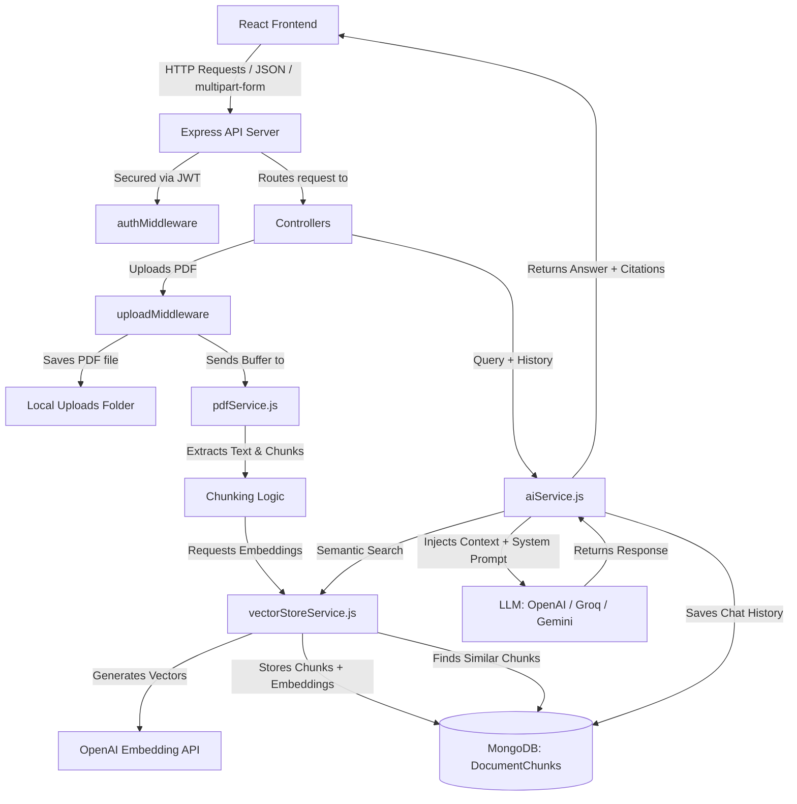

# AI Advocate Server: Comprehensive Architecture & File-by-File Guide

This document provides a detailed breakdown of the **Server** side of the **AI Advocate** application. It is designed to help you understand the architecture, data flow, and file responsibilities for your interview.

---

## 1. System Architecture Overview

AI Advocate is a MERN stack (MongoDB, Express, React, Node.js) web application. The server is built as a RESTful API with Node.js and Express, using MongoDB (via Mongoose) as the database.

The application incorporates a **RAG (Retrieval-Augmented Generation)** pipeline. Instead of relying on a heavy external Vector Database (like Pinecone or ChromaDB binaries) which could complicate deployment, it implements a highly portable and lightweight **vector store solution directly inside MongoDB** and performs in-memory cosine similarity matching.

### High-Level Architecture Flow



---

## 2. Directory Layout of the Server

```text
Server/
│
├── server.js               # Application entry point
├── package.json            # Node dependencies and npm scripts
├── .env                    # Environment variables (private credentials)
├── .env.example            # Environment variables template
│
├── config/
│   └── db.js               # MongoDB database connection setup
│
├── models/                 # Mongoose Database schemas
│   ├── User.js             # User accounts, credentials & roles
│   ├── Chat.js             # Chat threads containing individual messages
│   ├── Document.js         # Uploaded PDF document metadata & extracted text
│   ├── DocumentChunk.js    # Document chunks + 1536-dimensional embeddings
│   └── LegalQuery.js       # Audit collection tracking user queries & AI citations
│
├── middleware/             # Express middlewares
│   ├── authMiddleware.js   # JWT verification & role authorization
│   ├── uploadMiddleware.js # Multer configuration for file uploads (PDF validation)
│   ├── validationMiddleware.js # Input parameters validation rules (express-validator)
│   └── errorHandler.js     # Centralized error handler
│
├── routes/                 # Express route definitions
│   ├── authRoutes.js       # Auth endpoints (/api/auth)
│   ├── chatRoutes.js       # Chat endpoints (/api/chat)
│   ├── uploadRoutes.js     # PDF upload and docs retrieve (/api)
│   └── analyzeRoutes.js    # Contract analysis (/api/analyze)
│
├── controllers/            # Request handlers (business logic)
│   ├── authController.js   # Register, Login, Profile retrieving
│   ├── chatController.js   # Chat history, new threads, and QA logic
│   ├── uploadController.js # PDF parsing, chunking, embedding generation
│   └── analyzeController.js# Deep contract auditing & structured JSON reports
│
└── services/               # Utilities & Third-party integrations
    ├── pdfService.js       # PDF text extraction & recursive text chunker
    ├── vectorStoreService.js# Embedding generation & cosine similarity calculations
    └── aiService.js        # Core LLM prompt setup, fallback mock logic & disclaimers
```

---

## 3. Detailed File-by-File Explanation

### 3.1. Root Files

#### [server.js](file:///c:/Users/ashut/Desktop/Software%20Enginnering/AI%20Advocate/Server/server.js)
*   **Role:** The entry point of the server application.
*   **What it does:**
    *   Loads environment variables from `.env` using `dotenv`.
    *   Initializes the connection to MongoDB by calling `connectDB()`.
    *   Sets up Express, enabling trust proxy flags (crucial for accurate IP tracking when deployed behind reverse proxies like Nginx, Render, or Railway).
    *   Configures CORS (Cross-Origin Resource Sharing) dynamic matching to allow the frontend client (e.g., localhost:5173 or the URL specified in `FRONTEND_URL`) to access resources while rejecting unauthorized domains.
    *   Attaches JSON and URL-encoded body parsing middlewares.
    *   Serves the `uploads/` folder statically so users can view uploaded files via `/uploads/filename`.
    *   Mounts the API routers: `/api/auth`, `/api/chat`, `/api` (for upload/documents), and `/api/analyze`.
    *   Provides a health-check endpoint (`/api/health`) that returns the server status, environment, and uptime.
    *   Mounts the centralized `errorHandler` as the final middleware catch-all.
    *   Launches the server on the specified `PORT` (defaults to 5000).

---

### 3.2. Configuration Layer (`config/`)

#### [db.js](file:///c:/Users/ashut/Desktop/Software%20Enginnering/AI%20Advocate/Server/config/db.js)
*   **Role:** Handles database connection lifecycle.
*   **What it does:**
    *   Uses Mongoose to establish a connection to MongoDB using `process.env.MONGO_URI` (with a local fallback `mongodb://127.0.0.1:27017/ai_advocate`).
    *   Emits clear logging outputs to the terminal when the connection is established.
    *   Includes a `try-catch` block that prints connection errors and calls `process.exit(1)` to halt execution if the database connection fails, ensuring the server doesn't run in an invalid state.

---

### 3.3. Database Models (`models/`)

#### [User.js](file:///c:/Users/ashut/Desktop/Software%20Enginnering/AI%20Advocate/Server/models/User.js)
*   **Role:** Defines the user database structure and handles security utilities.
*   **What it does:**
    *   Defines schema with: `name`, `email` (unique, lowercase, validated), `password`, and `role` (enum: `['user', 'admin', 'associate', 'partner']`, defaulting to `user`).
    *   Contains a Mongoose pre-save middleware (`userSchema.pre('save')`) that hashes passwords using `bcryptjs` with 10 salt rounds whenever a user is created or updates their password.
    *   Provides an instance method `comparePassword(enteredPassword)` which uses bcrypt to safely check if a plaintext password matches the hashed password stored in the database.

#### [Chat.js](file:///c:/Users/ashut/Desktop/Software%20Enginnering/AI%20Advocate/Server/models/Chat.js)
*   **Role:** Models a conversation thread.
*   **What it does:**
    *   Defines `messageSchema` containing the sender (`user` or `ai`), message text, and timestamp.
    *   Defines `chatSchema` which represents an individual conversation thread. It holds a reference to the `User` who created it, a `name` (defaulting to "New Case Consultation"), and an array of nested messages following the `messageSchema`.
    *   Enables automatic `timestamps` to easily sort chat history by the last updated time.

#### [Document.js](file:///c:/Users/ashut/Desktop/Software%20Enginnering/AI%20Advocate/Server/models/Document.js)
*   **Role:** Models the metadata of an uploaded PDF document.
*   **What it does:**
    *   Stores information about the file: who uploaded it (`user` reference), the randomized server-side `filename` (to prevent name collisions), the `originalName` (what the user named it), the complete `extractedText` parsed from the PDF, `fileSize`, `filePath` (local storage location), and the `uploadDate`.

#### [DocumentChunk.js](file:///c:/Users/ashut/Desktop/Software%20Enginnering/AI%20Advocate/Server/models/DocumentChunk.js)
*   **Role:** Models split segments of document text and their vectors for the RAG search.
*   **What it does:**
    *   Stores `document` (referencing the parent Document) and `user` (referencing the owner).
    *   Stores the specific text snippet (`text`), the sequential `chunkIndex`, and the `embedding` (an array of numbers representing the 1536-dimensional vector generated by OpenAI).
    *   Creates a database compound index on `{ user: 1, document: 1 }` to optimize query performance when loading/searching chunks for a specific user's documents.

#### [LegalQuery.js](file:///c:/Users/ashut/Desktop/Software%20Enginnering/AI%20Advocate/Server/models/LegalQuery.js)
*   **Role:** Auditing collection.
*   **What it does:**
    *   Logs every single prompt a user submits, the AI's response, and the exact list of citations (including the filename, text snippet, and cosine similarity matching score) that were injected into the LLM context.
    *   This provides a complete paper trail of how the AI formulated its answers, which is crucial for compliance and logging user interactions.

---

### 3.4. Middleware Layer (`middleware/`)

#### [authMiddleware.js](file:///c:/Users/ashut/Desktop/Software%20Enginnering/AI%20Advocate/Server/middleware/authMiddleware.js)
*   **Role:** Secures route access.
*   **What it does:**
    *   `protect`: Intercepts requests, reads the `Authorization` header, extracts the `Bearer <token>`, and verifies the JWT token using `jwt.verify`. It then fetches the corresponding user from the database (excluding their password field) and attaches it to `req.user`. If the token is invalid, expired, or missing, it returns a `401 Unauthorized` response.
    *   `authorize(...roles)`: A helper that validates if the logged-in user's role matches the required roles for that route. If not, it blocks the request with a `403 Forbidden` response.

#### [uploadMiddleware.js](file:///c:/Users/ashut/Desktop/Software%20Enginnering/AI%20Advocate/Server/middleware/uploadMiddleware.js)
*   **Role:** Manages file uploads.
*   **What it does:**
    *   Ensures that the `./uploads` directory exists locally, creating it if it doesn't.
    *   Uses `multer` to configure disk storage. Filenames are randomized with a timestamp and random suffix to avoid name collisions (e.g. `file-1720610000-884210.pdf`).
    *   Enforces validation filters: restricts uploads strictly to PDFs (`application/pdf`) and checks file extensions.
    *   Enforces a maximum file size limit of 10MB to prevent server memory bloat.

#### [validationMiddleware.js](file:///c:/Users/ashut/Desktop/Software%20Enginnering/AI%20Advocate/Server/middleware/validationMiddleware.js)
*   **Role:** Validates request parameters before they hit controllers.
*   **What it does:**
    *   Defines field-level checks using `express-validator`.
    *   `registerValidationRules`: Validates that the registration email is a valid email formatting, normalizes it, and checks that the password is at least 6 characters.
    *   `loginValidationRules`: Validates that the email is a valid email formatting, normalizes it, and checks that the password is not empty.
    *   `validate`: Checks the validation errors array. If errors exist, it intercepts the request, blocks it, and returns a formatted `400 Bad Request` with the array of validation failures.

#### [errorHandler.js](file:///c:/Users/ashut/Desktop/Software%20Enginnering/AI%20Advocate/Server/middleware/errorHandler.js)
*   **Role:** Standardizes error responses across all routes.
*   **What it does:**
    *   Catches all exceptions thrown inside controllers.
    *   Logs the full stack trace to the server console.
    *   Formats the response structure cleanly: `{ success: false, message: ... }`. If running in development environment (`NODE_ENV === 'development'`), it exposes the error stack trace to simplify debugging.

---

### 3.5. Routes Layer (`routes/`)

#### [authRoutes.js](file:///c:/Users/ashut/Desktop/Software%20Enginnering/AI%20Advocate/Server/routes/authRoutes.js)
*   **Role:** Declares endpoints for authentications.
*   **What it does:**
    *   `POST /register`: Public route, applies `registerValidationRules` and `validate`, then calls the `register` controller.
    *   `POST /login`: Public route, applies `loginValidationRules` and `validate`, then calls the `login` controller.
    *   `GET /me`: Private route, applies the `protect` middleware, then calls `getMe`.

#### [chatRoutes.js](file:///c:/Users/ashut/Desktop/Software%20Enginnering/AI%20Advocate/Server/routes/chatRoutes.js)
*   **Role:** Declares chat threads endpoints.
*   **What it does:**
    *   Applies `protect` to all endpoints in this router.
    *   `POST /`: Submits a legal query to the AI assistant (`askQuestion` controller).
    *   `POST /new`: Instantiates a fresh empty chat conversation (`createNewChat` controller).
    *   `GET /history`: Retrieves all chat conversations belonging to the user (`getChats` controller).
    *   `GET /:id`: Retrieves messages of a specific chat thread (`getChatById` controller).
    *   `DELETE /:id`: Deletes a specific chat thread (`deleteChat` controller).

#### [uploadRoutes.js](file:///c:/Users/ashut/Desktop/Software%20Enginnering/AI%20Advocate/Server/routes/uploadRoutes.js)
*   **Role:** Declares document management endpoints.
*   **What it does:**
    *   Applies `protect` to all endpoints in this router.
    *   `POST /upload`: Uploads a PDF file using the `upload.single('file')` multer middleware, then runs the `uploadPDF` controller.
    *   `GET /documents`: Retrieves list of documents uploaded by the user (`getDocuments` controller).

#### [analyzeRoutes.js](file:///c:/Users/ashut/Desktop/Software%20Enginnering/AI%20Advocate/Server/routes/analyzeRoutes.js)
*   **Role:** Declares endpoints for contract analysis reports.
*   **What it does:**
    *   Applies `protect` to all endpoints in this router.
    *   `POST /`: Submits a document (via `documentId` or raw text) for deep structured analysis (`analyzeDocument` controller).

---

### 3.6. Controllers Layer (`controllers/`)

#### [authController.js](file:///c:/Users/ashut/Desktop/Software%20Enginnering/AI%20Advocate/Server/controllers/authController.js)
*   **Role:** Handles user registration, authentication, and session retrieval.
*   **What it does:**
    *   Contains `generateToken` helper to issue JWT tokens encoded with the user's ID, expiring in 30 days.
    *   `register`: Checks if email already exists in DB. If not, it creates a new `User`. If no name is provided, it extracts the prefix of the email (before `@`) and capitalizes it as a default. Returns user details along with the JWT.
    *   `login`: Finds the user by email, checks if the password matches using `user.comparePassword()`. If successful, returns the user record and a freshly generated JWT token.
    *   `getMe`: Returns the details of `req.user` (which was already validated and loaded by the `protect` middleware).

#### [chatController.js](file:///c:/Users/ashut/Desktop/Software%20Enginnering/AI%20Advocate/Server/controllers/chatController.js)
*   **Role:** Manages chat history operations and orchestrates RAG QA.
*   **What it does:**
    *   `getChats` / `getChatById` / `createNewChat` / `deleteChat`: Standard CRUD operations for chat threads, filtered by `user: req.user._id` to maintain privacy boundaries between users.
    *   `askQuestion`:
        1. Checks if `chatId` was provided. If yes, it retrieves that chat. If not, it automatically creates a new chat thread named after the user's query.
        2. Gathers the last 10 messages from the chat thread as `chatHistory` context.
        3. Calls `askRossMode(userId, query, chatHistory)` to obtain the AI response and matching document citations.
        4. Pushes the user's query and the AI's response text into the chat thread's message history. If the chat name was the default name ("New Case Consultation"), it renames the chat based on the user's query. Saves the chat thread to MongoDB.
        5. Saves a copy of the query, response, and citations in the `LegalQuery` audit collection.
        6. Returns the updated messages, chatId, chatName, and citations back to the client.

#### [uploadController.js](file:///c:/Users/ashut/Desktop/Software%20Enginnering/AI%20Advocate/Server/controllers/uploadController.js)
*   **Role:** Coordinates PDF parsing, chunking, and embedding generation.
*   **What it does:**
    *   `uploadPDF`:
        1. Validates that a file was received.
        2. Reads the file buffer and extracts plain text using `extractTextFromPDF(fileBuffer)` from `pdfService.js`.
        3. Creates a `Document` collection entry containing the text and metadata.
        4. Splits the text into overlap-bounded chunks using `chunkText(text)` from `pdfService.js`.
        5. Maps over each text chunk and calls `generateEmbedding(text)` (from `vectorStoreService.js`) to generate its 1536-dimensional embedding.
        6. Filters out any chunks that failed vector generation, and inserts all successful chunk records into MongoDB using `DocumentChunk.insertMany()`.
        7. Returns success status and counts to the client. If an error occurs, it cleans up (deletes) the uploaded local PDF file.
    *   `getDocuments`: Lists all documents uploaded by the authenticated user.

#### [analyzeController.js](file:///c:/Users/ashut/Desktop/Software%20Enginnering/AI%20Advocate/Server/controllers/analyzeController.js)
*   **Role:** Drives deep, structured contract audits.
*   **What it does:**
    *   `analyzeDocument`:
        *   Accepts either a `documentId` or raw `text`.
        *   If `documentId` is provided, it verifies ownership and retrieves the pre-extracted document text.
        *   Calls `analyzeContractContent(targetText)` (from `services/aiService.js`) to generate a structured analysis report containing summary, clauses with risk ratings, overall risks, and recommendations.
        *   Returns the analysis JSON report to the client.

---

### 3.7. Services Layer (`services/`)

#### [pdfService.js](file:///c:/Users/ashut/Desktop/Software%20Enginnering/AI%20Advocate/Server/services/pdfService.js)
*   **Role:** Low-level PDF utility service.
*   **What it does:**
    *   `extractTextFromPDF`: Utilizes the `pdf-parse` library to extract plain text, metadata, and page counts from raw binary buffers. It throws an error if no text is extracted (e.g. if the PDF is scanned as an image).
    *   `chunkText`: Recursively splits a long string into chunks (default size: 1000 characters, overlap: 200 characters). To avoid breaking words or sentences mid-character, it searches backwards (up to the overlap limit) from the chunk's end for the nearest space character (' ') and splits there. Chunks shorter than 10 characters are discarded as noise.

#### [vectorStoreService.js](file:///c:/Users/ashut/Desktop/Software%20Enginnering/AI%20Advocate/Server/services/vectorStoreService.js)
*   **Role:** Custom vector store service.
*   **What it does:**
    *   `generateEmbedding(text)`:
        *   Uses OpenAI API's `text-embedding-3-small` model to generate a 1536-dimensional vector for a block of text.
        *   **Offline/Mock Fallback:** If `GROQ_API_KEY` (which is used as the environment variable check) is not configured, or if the API call fails, it automatically generates a mock 1536-dimensional unit-normalized random vector. This prevents the server from crashing and allows full local development and testing without an internet connection or paid API key.
    *   `calculateCosineSimilarity(vecA, vecB)`:
        *   Calculates the cosine similarity score between two numeric arrays. It divides the dot product of the vectors by the product of their Euclidean norms:
            $$\text{Cosine Similarity} = \frac{\vec{A} \cdot \vec{B}}{\|\vec{A}\| \|\vec{B}\|}$$
        *   If the vectors are unit-normalized, this calculation simplifies directly to a dot product.
    *   `similaritySearch(userId, queryText, k)`:
        *   Generates a vector embedding of the user's search query.
        *   Retrieves all `DocumentChunk` records belonging to the user from MongoDB (ensuring strict multi-tenant isolation, so users can never query another user's documents).
        *   Calculates the cosine similarity between the query embedding and each chunk's embedding.
        *   Sorts all chunks in descending order of similarity score.
        *   Returns the top `k` matching chunks.

#### [aiService.js](file:///c:/Users/ashut/Desktop/Software%20Enginnering/AI%20Advocate/Server/services/aiService.js)
*   **Role:** The core LLM orchestration service.
*   **What it does:**
    *   `getOpenAIClient`: Dynamically configures the API provider client. If the key starts with `gsk_`, it redirects the base URL to **Groq**'s endpoints to use Groq's high-speed Llama models. Otherwise, it points to standard **OpenAI** or mock endpoints.
    *   `askRossMode(userId, userQuery, chatHistory)`:
        1. Calls `similaritySearch(userId, userQuery, 3)` to fetch the top 3 matching chunks relevant to the user's query.
        2. Formats these matching chunks into a cohesive `contextText` string.
        3. **Fallback Logic:** If no API key is set, it triggers a mock offline mode, checking the query text for common keywords (like 'NDA', 'risk', 'California', 'hi') and returning pre-drafted expert-level legal mock replies.
        4. If an API key is present, it constructs a detailed `systemPrompt` instructing the assistant that it is "AI Advocate, an elite legal assistant", providing the context text, and forcing it to reference and cite the context and append a legal disclaimer.
        5. Combines the system prompt, chat history messages, and user query, and fires a request to the configured LLM:
            *   Groq: `llama-3.3-70b-versatile`
            *   Gemini: `gemini-1.5-flash`
            *   OpenAI: `gpt-4o-mini`
        6. Uses a lower `temperature` of `0.3` to keep responses precise and factual.
        7. Appends a standardized legal disclaimer to the response: `"\n\n*AI-generated legal guidance may not replace professional legal advice.*"`.
        8. Catches API failures (like quota limits or network errors), logs a warning, and returns a high-quality mock response instead of throwing a server error, appending a notice that the system is operating in offline mode.
    *   `analyzeContractContent(textToAnalyze)`:
        *   Used for structured contract audits.
        *   If offline, returns a default mock report.
        *   If online, sends a system prompt instructing the model to operate as a contract auditor and output **ONLY valid JSON** matching a specified schema (containing keys: `summary`, `clauses` array, `risks` array, and `recommendations` array).
        *   Uses OpenAI's JSON mode (`response_format: { type: "json_object" }`) and parses the string response into a javascript object.

---

## 4. Key Workflows & Pipelines (For Interview Prep)

These step-by-step descriptions are perfect for explaining how your server handles processes during your interview:

### 1. The RAG Pipeline (PDF Processing & Retrieval)
1.  **Upload:** User posts a PDF via the UI. Express routes this to `POST /api/upload`, and `uploadMiddleware` (multer) parses it, saves it to `/uploads`, and attaches the file info to `req.file`.
2.  **Text Extraction:** `uploadController` reads the file buffer, passing it to `pdfService` (`pdf-parse`) to extract plain text.
3.  **Database Storage:** A new `Document` metadata record is created in MongoDB.
4.  **Chunking:** The extracted text is split into semantic paragraphs of 1000 characters with 200 characters overlap using `pdfService.chunkText`.
5.  **Embedding & Vector Indexing:** For each text chunk, `vectorStoreService` makes an API call to generate a 1536-dimensional vector using OpenAI's `text-embedding-3-small`. The chunks, parent document ID, owner ID, text, and vector embeddings are stored in `DocumentChunks` in MongoDB.

### 2. The Semantic Search & Q&A Pipeline (Chatting with Documents)
1.  **User query:** User types a question and submits it to `POST /api/chat`.
2.  **Session check:** `chatController` locates the chat thread (or creates a new one).
3.  **Semantic Search:** `vectorStoreService.similaritySearch` is called:
    *   Generates an embedding of the query.
    *   Queries `DocumentChunks` matching the current user.
    *   Computes the Cosine Similarity between the query's vector and each chunk's vector in memory.
    *   Sorts and retrieves the top 3 chunks (contexts).
4.  **Prompt construction:** `aiService` formats the matching chunks as sources and builds the payload (System prompt instructing LLM + context text + past 10 message exchanges + current question).
5.  **LLM Call:** Sends the payload to the LLM (OpenAI/Groq/Gemini).
6.  **Response handling:** The LLM returns a response. The service verifies the legal disclaimer is present, appends it if missing, saves the exchange in the `Chat` messages array, and saves an audit log in `LegalQuery`. It then sends the response and the source citations back to the frontend.

---

## 5. Typical Technical Interview Questions on this Code

Be prepared to answer these questions during your interview:

*   **Q: Why did you implement similarity search inside MongoDB/Node.js memory instead of using a vector database like Pinecone?**
    *   *Answer:* It was a conscious design choice to prioritize portability, ease of setup, and cost-efficiency. Setting up external vector databases introduces network latency, costs, and complex configuration steps. By storing vectors directly in MongoDB and writing an in-memory cosine similarity matching engine, we keep the entire service self-contained, lightweight, and extremely easy to run and deploy locally or on free hosting tiers, while easily handling the typical volume of legal documents uploaded by a single user.
*   **Q: How do you prevent data leaks (multi-tenancy) so users don't see each other's uploaded documents?**
    *   *Answer:* Security and isolation are built directly into our database queries. Whenever we perform similarity searches or query document metadata, we filter by the authenticated user's ID (`req.user._id`), which is securely populated by our JWT validation middleware. We also index our chunks collection on `{ user: 1, document: 1 }` to make these tenant-isolated queries fast.
*   **Q: What happens if your OpenAI API key runs out of credits or has a rate limit error? How is the system resilient?**
    *   *Answer:* We implemented an offline/mock fallback mechanism in our services. In `aiService.js` and `vectorStoreService.js`, if no API key is provided, or if the API call throws a `429` (Quota/Billing) error or any other exception, the system catches the error, logs a warning, and immediately falls back to generating a mock embedding vector and an offline heuristic legal logic response (matching keywords like 'NDA', 'California code', etc.). This prevents the app from crashing and keeps the user interface responsive with helpful mock legal content and a system warning notice.
*   **Q: Why do you have an overlap parameter in your text chunking algorithm?**
    *   *Answer:* Text chunking can cut sentences in half. Having an overlap (e.g. 200 characters) ensures that context from the end of one chunk is carried over to the beginning of the next. This prevents semantic information that lies right on a boundary line from being lost or fragmented, leading to much more accurate embeddings and retrieval.
